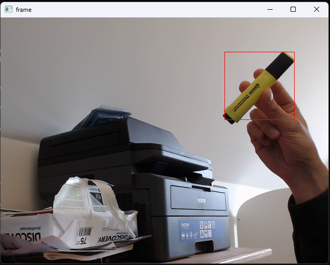

# LiveColorTracking
track custom color in live webcam feed

# Instructions
Install the required packages in a custom conda environment by running the following command:

```bash
conda create --name EnvName --file environment.txt
```

Activate said environment with the following:

```bash
conda activate EnvName
```

and then run the program with:

```bash
python main.py
```

# Result

All objects in the selected RGB colour will be tracked in the webcam feed like so:



Press q to exit the frame.